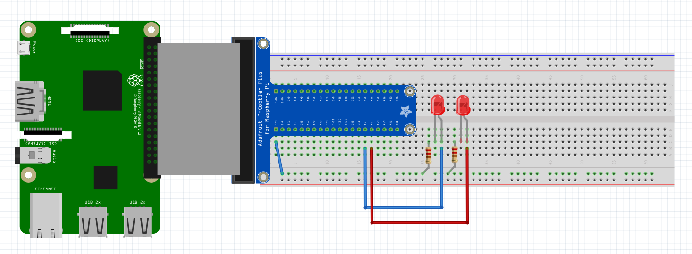

# flaskPiLEDController

Simple flask-based web server which controls LEDs connected via protoboard to GPIO Raspberry Pi pins through HTTP requests.

# How to use

First of all, we have to set our GPIO pins wired correctly (pin 5 for green LED and pin 6 for red LED). This is my wiring but it can be done in many other ways:



Then make sure to install flask in your RPi:

```
sudo apt-get install python3 python3-pip
pip install flask
```

Once flask is ready, clone this repository into Raspberry Pi home folder:

```
pi@raspberrypi:~ $ cd $HOME
pi@raspberrypi:~ $ git clone https://github.com/joeltaberne/raspberryPi.git
```

Next step is setting flask to execute piLEDControl.py:

```
export FLASK_APP=piLEDControl.py
```

By default, this flask application will run in port 5000. This can be changed in piLEDControl.py in the lines at the end of the file:

```
if __name__ == '__main__':
    app.run(port = 5000)
```

Everything is ready so you just need to run the flask application:

```
flask run
```

OR

```
flask run --host=0.0.0.0 (flask app will be visible in the local network)
```

If everything worked well you should see this output:

```
 * Serving Flask app "piLEDControl.py"
 * Environment: production
   WARNING: This is a development server. Do not use it in a production deployment.
   Use a production WSGI server instead.
 * Debug mode: off
 * Running on http://0.0.0.0:5000/ (Press CTRL+C to quit)
```

You can check ```localhost:5000``` and start trying it.